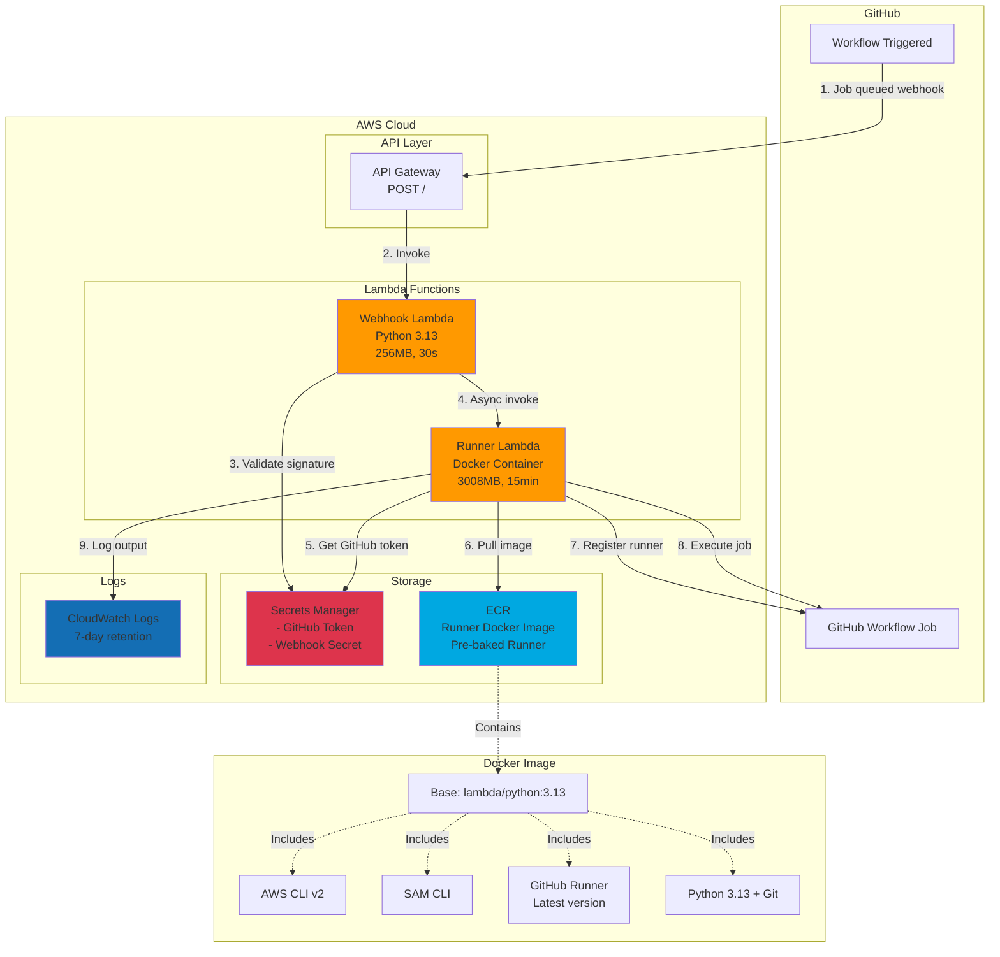
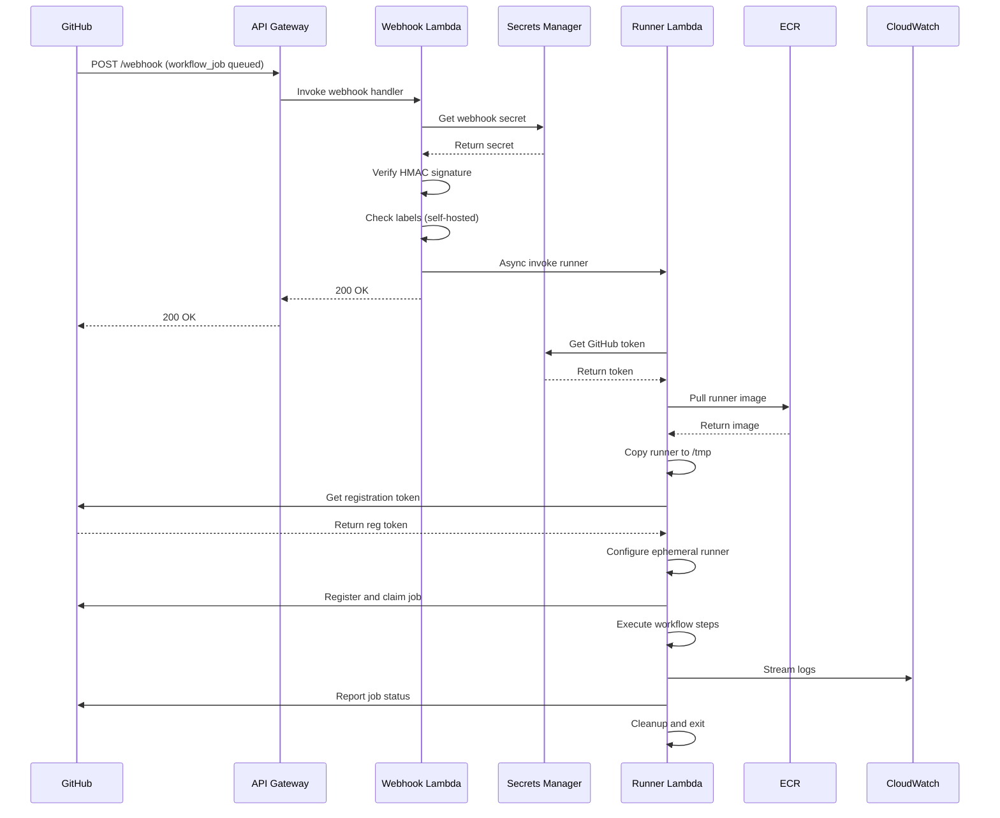
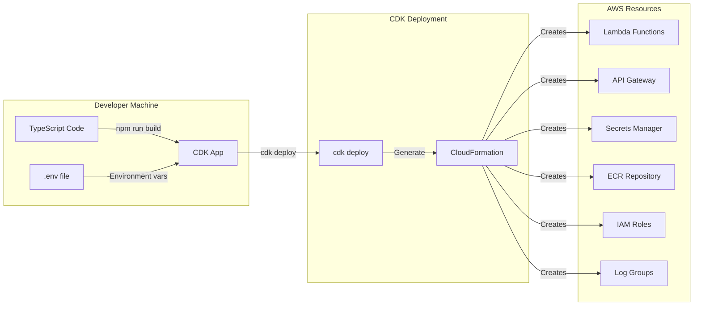
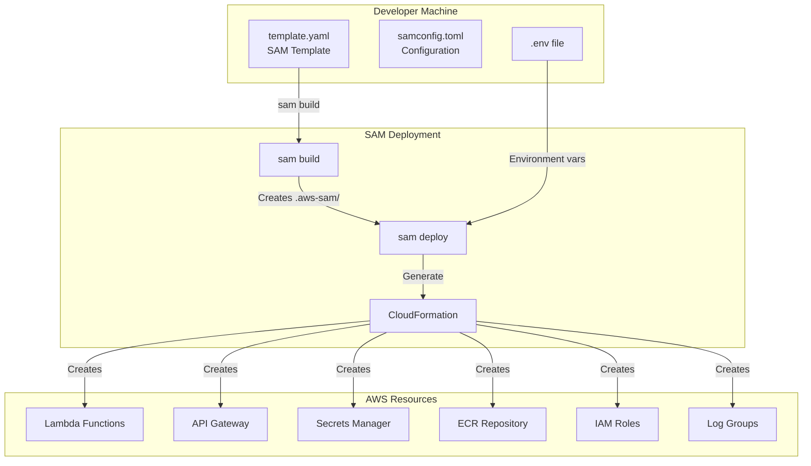

# Architecture Diagram

## Current Implementation (AWS CDK)

## Component Flow

## Deployment Architecture (CDK)

---

## What Would SAM Look Like?

If we convert to SAM, the structure would be:

---

## Key Differences: CDK vs SAM

| Aspect | Current (CDK) | Proposed (SAM) |
|--------|---------------|----------------|
| **Language** | TypeScript | YAML |
| **Structure** | OOP, programmatic | Declarative |
| **Files** | `lib/*.ts`, `bin/*.ts` | `template.yaml` |
| **Build** | `npm run build`, `cdk synth` | `sam build` |
| **Deploy** | `cdk deploy` | `sam deploy` |
| **Local Testing** | Not supported | `sam local invoke` |
| **Complexity** | Higher (more flexible) | Lower (simpler) |
| **Learning Curve** | Steeper | Gentler |

---

## Questions Before Converting

1. **Do you have an existing SAM template pattern?** (from aws_fastapi_template?)
2. **What's the reason for SAM over CDK?** (team preference, existing patterns, local testing?)
3. **Timeline?** (Is this urgent or can we evaluate first?)
4. **Keep what we have?** (Some features, scripts, documentation?)

Would you like me to:
- ✅ See your `aws_fastapi_template` to match the pattern?
- ✅ Create a SAM template matching current functionality?
- ✅ Keep CDK but add SAM as deployment option?
- ✅ Just create diagrams for approval of current design?

